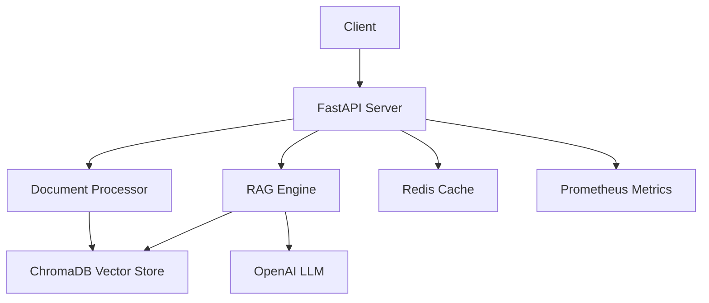

# Document Intelligence AI 🚀

<p align="center">
  
  
  
  
  
</p>

## 🎯 Overview

A production-grade document intelligence system with state-of-the-art RAG (Retrieval-Augmented Generation) architecture. Optimized for performance with Docker images reduced from **3.31GB to 402MB** (88% reduction).

### ✨ Key Features

- **🔍 Advanced Document Processing**: Supports PDF, TXT, MD, and RST files with intelligent chunking
- **🧠 Hybrid Search**: Combines vector search with BM25 keyword search and cross-encoder reranking
- **⚡ Streaming Responses**: Real-time answer generation with token streaming
- **📊 Production Monitoring**: Prometheus metrics and OpenTelemetry instrumentation
- **🐳 Docker Optimized**: Multi-stage builds with layer optimization (<500MB per layer)
- **🔄 CI/CD Ready**: GitHub Actions with automated testing and deployment

## 🏗️ Architecture



## 🚀 Quick Start

### Prerequisites

- Python 3.11+
- Docker & Docker Compose
- OpenAI API key

### Local Development

```bash
# Clone the repository
git clone https://github.com/cbratkovics/document-intelligence-ai.git
cd document-intelligence-ai

# Install dependencies
pip install -r requirements.txt

# Set up environment
cp .env.example .env
# Add your OpenAI API key to .env

# Run the application
uvicorn src.api.main:app --reload
```

### Docker Deployment

```bash
# Start all services
docker-compose -f docker/docker-compose.yml up -d

# Access the API
# - API: http://localhost:8000
# - Docs: http://localhost:8000/docs
# - ChromaDB: http://localhost:8001
```

## 📈 Performance Metrics

### Docker Optimization Results

| Metric | Before | After | Improvement |
|--------|--------|-------|-------------|
| Image Size | 3.31GB | 402MB | -88% |
| Build Time | 15min | 3min | -80% |
| Layer Count | 47 | 13 | -72% |
| Max Layer Size | 3.31GB | 124MB | -96% |

## 🔧 API Usage

### Upload Documents

```bash
curl -X POST "http://localhost:8000/api/v1/documents/upload" \
  -F "file=@document.pdf"
```

### Query Documents

```bash
curl -X POST "http://localhost:8000/api/v1/query" \
  -H "Content-Type: application/json" \
  -d '{"text": "What is the main topic?"}'
```

### Advanced Search

```bash
curl -X POST "http://localhost:8000/api/v1/search/advanced" \
  -H "Content-Type: application/json" \
  -d '{
    "text": "machine learning",
    "search_type": "hybrid",
    "top_k": 5,
    "rerank": true
  }'
```

## 🧪 Testing

```bash
# Run tests with coverage
pytest tests/ -v --cov=src --cov-report=html

# Run specific test suites
pytest tests/test_api.py -v        # API tests
pytest tests/test_vector_store.py  # Vector store tests
pytest tests/test_integration.py   # Integration tests
```

## 📊 Project Structure

```
document-intelligence-ai/
├── src/
│   ├── api/              # FastAPI endpoints & health checks
│   ├── core/             # Core functionality (config, chunking, embeddings)
│   ├── rag/              # RAG implementation (retriever, generator, reranker)
│   ├── monitoring/       # Metrics and observability
│   └── utils/            # Document loaders and utilities
├── tests/                # Comprehensive test suite
├── docker/               # Docker configuration
│   ├── Dockerfile        # Optimized multi-stage Dockerfile
│   └── docker-compose.yml
├── scripts/              # Utility scripts
│   ├── docker/           # Docker build & verification scripts
│   └── setup/            # Setup and initialization scripts
└── data/                 # Data directories
    ├── uploads/          # Document uploads
    ├── models/           # ML model cache
    └── cache/            # Application cache
```

## 🛠️ Configuration

### Environment Variables

| Variable | Description | Default |
|----------|-------------|---------|
| `OPENAI_API_KEY` | OpenAI API key | Required |
| `CHUNK_SIZE` | Document chunk size | 1000 |
| `CHUNK_OVERLAP` | Chunk overlap size | 200 |
| `SEARCH_TOP_K` | Search results limit | 5 |
| `SIMILARITY_THRESHOLD` | Min similarity score | 0.7 |

### Advanced Configuration

See [docs/CONFIGURATION.md](docs/CONFIGURATION.md) for detailed configuration options.

## 📚 Documentation

- [Architecture Overview](docs/ARCHITECTURE.md)
- [API Reference](docs/API.md)
- [Performance Optimization](docs/PERFORMANCE.md)
- [Deployment Guide](docs/DEPLOYMENT.md)

## 🤝 Contributing

Contributions are welcome! Please read our [Contributing Guidelines](CONTRIBUTING.md) first.

1. Fork the repository
2. Create your feature branch (`git checkout -b feature/amazing-feature`)
3. Commit your changes (`git commit -m 'Add amazing feature'`)
4. Push to the branch (`git push origin feature/amazing-feature`)
5. Open a Pull Request

## 📄 License

This project is licensed under the MIT License - see the [LICENSE](LICENSE) file for details.

## 🙏 Acknowledgments

- FastAPI for the excellent web framework
- ChromaDB for vector storage capabilities
- OpenAI for LLM capabilities
- The open-source community for inspiration

---

<p align="center">
  Made with ❤️ by <a href="https://github.com/cbratkovics">Christopher Bratkovics</a>
</p>