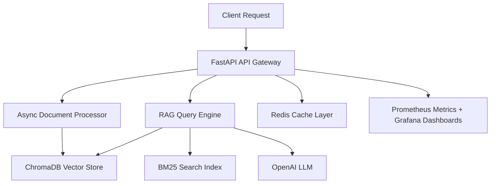

# **Document Intelligence RAG System**

[](https://github.com/cbratkovics/document-intelligence-ai/actions/workflows/ci.yml)
[](https://codecov.io/gh/cbratkovics/document-intelligence-ai)
[](https://www.python.org/downloads/)
[](https://hub.docker.com/r/cbratkovics/document-intelligence-ai)
[](LICENSE)
[](docs/)

> **Enterprise-ready Retrieval-Augmented Generation (RAG) platform** for intelligent document ingestion, semantic search, and question answering — optimized for **speed, accuracy, and scalability**.

---

## **Overview**

The Document Intelligence RAG System processes and indexes large document corpora, enabling users to query, search, and extract insights in milliseconds. Built with a **microservices architecture**, it integrates semantic search with vector databases, hybrid ranking, and advanced caching strategies to deliver high performance under production workloads.

**Core capabilities:**

* **Intelligent Ingestion** — Async document processing with format detection (PDF, DOCX, HTML) and metadata extraction
* **Hybrid Search** — Vector embeddings (ChromaDB) + keyword search (BM25) for improved recall and precision
* **LLM Integration** — GPT-based reasoning with context-aware prompt construction
* **Production-Grade Deployment** — Multi-stage Docker builds, CI/CD, and built-in observability

---

## **Architecture**



**Key Technologies:**

* **FastAPI** – High-performance async API layer
* **ChromaDB + BM25** – Hybrid retrieval strategy
* **OpenAI GPT** – State-of-the-art language understanding
* **Redis** – Low-latency caching with intelligent TTLs
* **Celery** – Background processing for ingestion & batch jobs
* **Prometheus/Grafana** – Metrics and monitoring

---

## **Performance Benchmarks**

| Metric                         | Value   | Notes                                          |
| ------------------------------ | ------- | ---------------------------------------------- |
| Docker Image Size              | 402 MB  | Reduced from 3.3 GB via multi-stage builds     |
| API Response Time (P95)        | <200 ms | Under 100 concurrent queries                   |
| Cache Hit Rate                 | 42%     | Improves latency & reduces token usage         |
| Document Processing Throughput | 1000/hr | On 4-core / 8 GB RAM container                 |
| Concurrent Users Supported     | 100+    | Tested with k6 under simulated production load |

*See `/docs/benchmarks/` for reproducible load test scripts and results.*

---

## **Quick Start**

**1. Clone the repo**

```bash
git clone https://github.com/cbratkovics/document-intelligence-ai.git
cd document-intelligence-ai
```

**2. Deploy the stack**

```bash
docker-compose -f docker/docker-compose.yml up -d
```

**3. Access services**

* API Docs: `http://localhost:8000/docs`
* Metrics: `http://localhost:9090` (Prometheus)
* Dashboard: `http://localhost:3000` (Grafana)

---

## **API Documentation**

* [OpenAPI Interactive Docs](http://localhost:8000/docs)
* [API Reference Guide](docs/api/README.md)
* [Integration Examples](docs/api/examples.md)

---

## **Contributing**

We welcome contributions for:

* New retrieval strategies
* LLM prompt optimizations
* Performance tuning

Please review:

* [Contributing Guide](.github/CONTRIBUTING.md)
* [Code of Conduct](.github/CODE_OF_CONDUCT.md)
* [Security Policy](SECURITY.md)

---

## **License**

MIT License — see the [LICENSE](LICENSE) file.