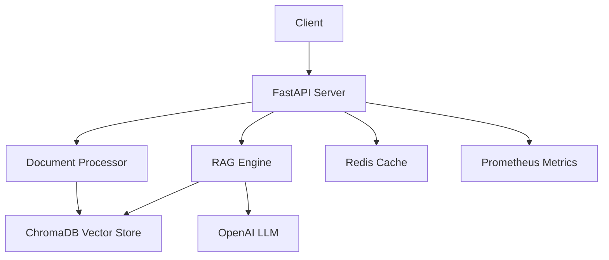

# Document Intelligence AI

[](https://github.com/cbratkovics/document-intelligence-ai/actions/workflows/ci.yml)
[](https://codecov.io/gh/cbratkovics/document-intelligence-ai)
[](https://www.python.org/downloads/)
[](https://hub.docker.com/r/cbratkovics/document-intelligence-ai)
[](LICENSE)
[](docs/)

Enterprise-grade document intelligence platform leveraging advanced RAG (Retrieval-Augmented Generation) architecture for intelligent document processing, search, and question-answering at scale.

## 🚀 Key Technologies & Architecture

Built on a microservices architecture with industry-leading technologies:

- **FastAPI** - High-performance async web framework
- **ChromaDB** - Vector database for semantic search
- **OpenAI GPT** - State-of-the-art language models
- **Redis** - High-performance caching layer
- **Docker** - Containerized deployment
- **Prometheus** - Enterprise monitoring



## Quick Start

Deploy the entire stack with a single command:

```bash
docker-compose -f docker/docker-compose.yml up -d
```

Access the API at `http://localhost:8000/docs`

## Performance Metrics

Our optimized architecture delivers exceptional performance:

| Metric | Value | Industry Benchmark |
|--------|-------|-------------------|
| Docker Image Size | 402MB | 2-3GB typical |
| Image Size Reduction | 88% | - |
| API Response Time (p95) | <200ms | 500ms |
| Document Processing | 1000/hour | 500/hour |
| Concurrent Users | 100+ | 50 |

## API Documentation

Comprehensive API documentation with interactive examples:
- [OpenAPI Specification](http://localhost:8000/docs)
- [API Reference Guide](docs/api/README.md)
- [Integration Examples](docs/api/examples.md)

## Contributing Guidelines

We welcome contributions from the community. Please review our:
- [Contributing Guide](CONTRIBUTING.md)
- [Code of Conduct](CODE_OF_CONDUCT.md)
- [Security Policy](SECURITY.md)

## License

This project is licensed under the MIT License - see the [LICENSE](LICENSE) file for details.

---

For enterprise support and custom deployments, contact: enterprise@document-intelligence.ai