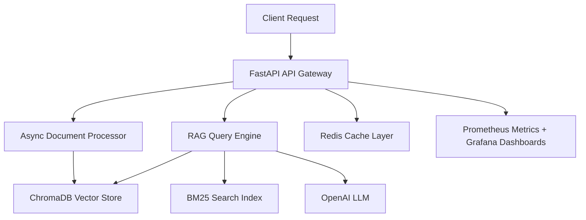

# **Document Intelligence RAG System**

<div align="center">

[](https://github.com/cbratkovics/document-intelligence-ai/actions/workflows/ci.yml)
[](https://codecov.io/gh/cbratkovics/document-intelligence-ai)
[](https://www.python.org/downloads/)
[](LICENSE)
[](docs/)

</div>

> **Retrieval-Augmented Generation (RAG) system** for document ingestion, hybrid semantic search, and question answering.

## **Capabilities**

| Capability | Implementation |
|------------|----------------|
| **Hybrid Retrieval** | ChromaDB dense vectors fused with BM25 keyword ranking |
| **Reranking** | Cross-encoder reranking over fused candidates |
| **Semantic Caching** | Similarity-threshold cache to avoid repeat LLM calls |
| **Chunking** | Semantic, sliding window, recursive, and sentence-based strategies |
| **Container Build** | Multi-stage Docker build with split base and ML dependency layers |

---


## **Overview**

The Document Intelligence RAG System ingests and indexes document corpora so they can be queried in natural language. It combines vector search over ChromaDB with BM25 keyword ranking, applies cross-encoder reranking to the fused results, and caches semantically similar queries to avoid redundant LLM calls.

**Core capabilities:**

* **Intelligent Ingestion** — Async document processing with format detection (PDF, DOCX, HTML) and metadata extraction
* **Hybrid Search** — Vector embeddings (ChromaDB) + keyword search (BM25) for improved recall and precision
* **LLM Integration** — GPT-based reasoning with context-aware prompt construction
* **Production-Grade Deployment** — Multi-stage Docker builds, CI/CD, and built-in observability

---

## **Architecture**


```mermaid
graph TD
    A[Client Request] --> B[FastAPI API Gateway]
    B --> C[Async Document Processor]
    B --> D[RAG Query Engine]
    C --> E[ChromaDB Vector Store]
    D --> E
    D --> F[BM25 Search Index]
    D --> G[OpenAI LLM]
    B --> H[Redis Cache Layer]
    B --> I[Prometheus Metrics + Grafana Dashboards]
```

**Key Technologies:**

* **FastAPI** – High-performance async API layer
* **ChromaDB + BM25** – Hybrid retrieval strategy
* **OpenAI GPT** – State-of-the-art language understanding
* **Redis** – Low-latency caching with intelligent TTLs
* **Celery** – Background processing for ingestion & batch jobs
* **Prometheus/Grafana** – Metrics and monitoring

---

## **Performance and Evaluation**

This repository does not publish retrieval quality, latency, or throughput figures.

Retrieval quality depends on your corpus, chunking strategy, and embedding model. Latency and
throughput depend on your hardware, index size, and which LLM you call. Numbers measured against
one corpus would not describe yours.

`eval/retrieval_metrics.py` implements nDCG, MRR, precision@k, and recall@k so you can evaluate
against your own labeled set and report what you measure.

---


## **Chunking Strategies**

| Strategy | Chunk Size | Overlap | Use Case | Performance |
|----------|------------|---------|----------|-------------|
| **Semantic Chunking** | Variable | N/A | Technical docs | Best coherence |
| **Sliding Window** | 512 tokens | 128 tokens | Long documents | Balanced |
| **Recursive Split** | 1000 chars | 200 chars | Mixed content | Fast ingestion |
| **Sentence-Based** | 3-5 sentences | 1 sentence | Q&A datasets | High precision |

*Configuration: `app/chunking/strategies.py`*

---

## **Embedding Model Comparison**

| Model | Dimensions | Speed | Quality | Cost | Use Case |
|-------|------------|-------|---------|------|----------|
| **OpenAI ada-002** | 1536 | Fast | Excellent | $0.0001/1K tokens | Production default |
| **all-MiniLM-L6-v2** | 384 | Very Fast | Good | Free (local) | High-volume ingestion |
| **all-mpnet-base-v2** | 768 | Moderate | Very Good | Free (local) | Quality-focused |
| **instructor-xl** | 768 | Slow | Best | Free (local) | Domain-specific |

*Switch models via: `EMBEDDING_MODEL` env var or `app/embeddings/factory.py`*

---

## **Quick Start**

### **Local Development**

```bash
git clone https://github.com/cbratkovics/document-intelligence-ai.git
cd document-intelligence-ai

# Install dependencies
pip install -r requirements-ml.txt

# Start services
docker-compose -f docker/docker-compose.yml up -d

# Run the application
uvicorn src.api.main:app --reload --host 0.0.0.0 --port 8000
```

### **Production Deployment (Kubernetes)**

```bash
# Apply configurations
kubectl apply -f k8s/namespace.yaml
kubectl apply -f k8s/configmap.yaml
kubectl apply -f k8s/secrets.yaml

# Deploy services
kubectl apply -f k8s/redis-deployment.yaml
kubectl apply -f k8s/chromadb-deployment.yaml
kubectl apply -f k8s/app-deployment.yaml

# Expose via ingress
kubectl apply -f k8s/ingress.yaml
```

### **Access Services**

* **API Docs**: `http://localhost:8000/docs`
* **Metrics**: `http://localhost:9090` (Prometheus)
* **Dashboard**: `http://localhost:3000` (Grafana)
* **Health Check**: `http://localhost:8000/health`

---

## **API Documentation**

* [OpenAPI Interactive Docs](http://localhost:8000/docs)
* [API Reference Guide](docs/api/README.md)
* [Integration Examples](docs/api/examples.md)

---

## **Contributing**

We welcome contributions for:

* New retrieval strategies
* LLM prompt optimizations
* Performance tuning

Please review:

* [Contributing Guide](.github/CONTRIBUTING.md)
* [Code of Conduct](.github/CODE_OF_CONDUCT.md)
* [Security Policy](SECURITY.md)

---

## **License**

MIT License — see the [LICENSE](LICENSE) file.