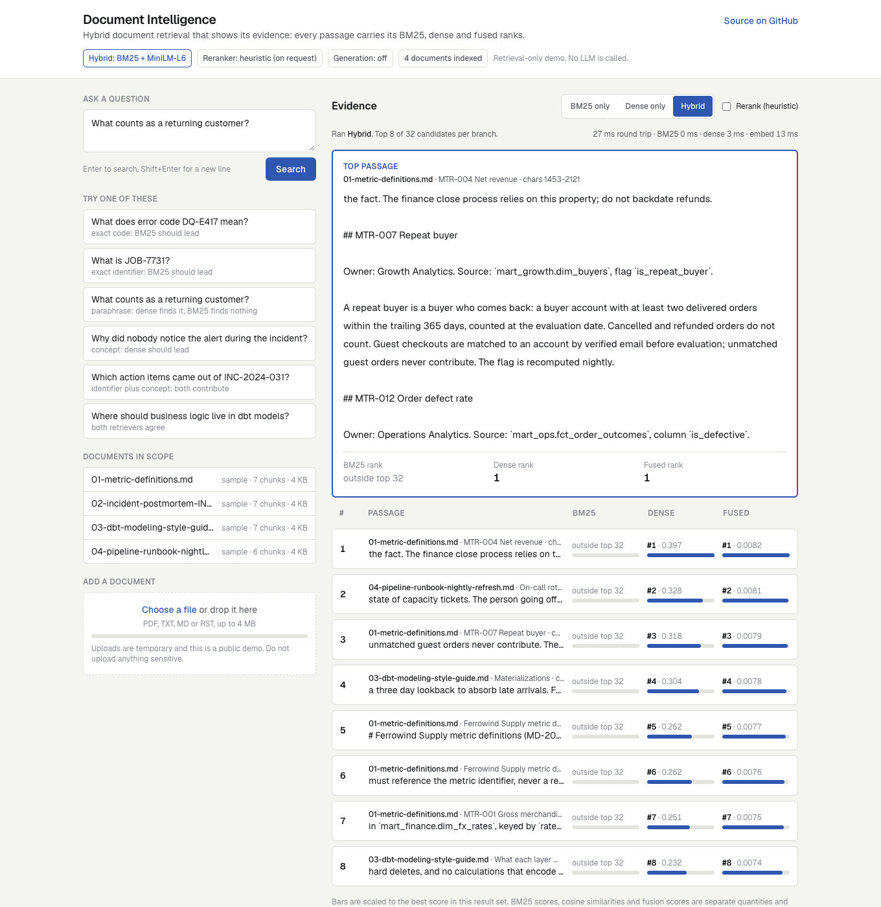

# Document Intelligence RAG System

Document search and evidence-grounded question answering over a local corpus,
with a public demo that shows exactly why each passage was retrieved.

[](https://github.com/cbratkovics/document-intelligence-ai/actions/workflows/ci.yml)
[](https://www.python.org/downloads/)
[](LICENSE)

> See the [engineering case study](docs/ENGINEERING_CASE_STUDY.md) for lifecycle
> guarantees, scoped retrieval, implementation evidence, evaluation boundaries,
> and a credential-free local walkthrough of the API.

**Live demo:** [frontend-doc-intel.vercel.app](https://frontend-doc-intel.vercel.app) ·
**API:** [huggingface.co/spaces/cbratkovics/document-intelligence-ai](https://huggingface.co/spaces/cbratkovics/document-intelligence-ai)




The demo is retrieval-only. It runs BM25 and a MiniLM dense retriever over a
small fictional corpus, fuses them with reciprocal rank fusion, and shows each
passage's BM25 rank, dense rank and fused rank next to each other. Switching
the mode re-runs the same question so the difference is visible. No language
model is called, for two reasons: it keeps the demo at zero cost forever, and
it removes the abuse surface of a public endpoint that spends someone's API
budget. Answer generation with citation validation exists in the code and is
tested with provider doubles; it was not exercised against a live provider in
this repository and is disabled in the demo.

## What the demo shows

The example questions are labelled with what to watch:

- Exact identifiers such as `DQ-E417` or `JOB-7731`, where BM25 leads.
- Paraphrases such as "returning customer" for a document that only says
  "repeat buyer", where BM25 finds nothing and the dense retriever does.
- Concept questions where both contribute and fusion changes the order.

Each hit carries `lexical_rank`, `vector_rank`, `fusion_rank` and the final
rank separately, plus the raw BM25 score, cosine similarity and fusion score.
A rank is shown only when that branch actually ran; "outside top N" means the
chunk was not among that branch's candidates.

## Architecture as deployed

```
Browser ── Vercel (Next.js route handlers) ── Hugging Face Space (FastAPI, Docker)
              adds X-API-Key from server env        BM25 + fastembed MiniLM (ONNX) -> RRF
              forwards visitor IP as X-Client-IP    heuristic reranker on request
              allowlist: health, search, upload,    ephemeral storage, 4 seeded documents
                document list, document chunks      per-client and global rate limits
              scopes every search to seeded docs    4 MB uploads, 24-document cap with
                plus this browser's own uploads       oldest-first eviction
```

The browser never talks to the Space. The API key lives only in Vercel's
server-side environment and in the Space's secrets. The GitHub Actions
workflow `deploy-space.yml` assembles the Space repository from `src/`,
`app/`, `scripts/`, `data/samples/`, the requirements files and
`deploy/space/` after CI passes on `main`, and force-pushes it with
`HF_TOKEN`.

Inside the API, the pipeline is unchanged from the local design:

```
upload -> validate + extract (pypdf / UTF-8) -> chunk (offsets, pages, sections)
       -> manifest (SQLite, status=indexing) -> embeddings (optional) -> Chroma (cosine)
       -> commit (status=ready) -> BM25 rebuilt from manifest -> answer cache cleared

query  -> scope check (unknown/non-ready docs rejected) -> BM25 + vector candidates (scoped)
       -> RRF fusion by chunk id -> hydrate from manifest (ready docs, current version only)
       -> optional rerank of the full pool -> top-k -> context budget with labels [S1..Sn]
       -> generation (optional) -> citation validation -> status + sources
```

One process serves one corpus. See [docs/ARCHITECTURE.md](docs/ARCHITECTURE.md)
for the invariants, score semantics and the evidence behind each claim.

## Demo limits

- Retrieval only. `GENERATION_PROVIDER=none`; no provider SDK is installed
  in the image. `tests/test_demo_safety.py` loads the Space configuration
  with a fake `OPENAI_API_KEY` in the environment and proves no paid provider
  can be resolved and the whole flow runs with sockets blocked.
- One shared corpus. Uploads are visible only to the browser that made them
  because the frontend filters by ids it holds; this is a convenience
  filter, not tenant isolation. Do not upload anything sensitive.
- Uploads: `.txt`, `.md`, `.rst`, `.pdf` (text layer only), 4 MB. DOCX,
  HTML and scanned PDFs are not supported.
- At most 24 documents; the oldest upload is evicted when a new one arrives.
  The four seeded samples are never evicted.
- Ephemeral storage: everything resets when the Space restarts, and the free
  tier sleeps after inactivity, so the first visit can take about 30 seconds.
- Rate limits per visitor and globally; the page reports when they apply.
- The corpus is four short fictional documents about an invented company's
  data platform. Nothing here is a benchmark and no retrieval quality figure
  is claimed.

## Run it locally

Two terminals, tested on macOS with Python 3.11 and Node 20+.

```bash
# Terminal 1: the API in the demo configuration (hybrid retrieval, ONNX MiniLM)
git clone https://github.com/cbratkovics/document-intelligence-ai.git
cd document-intelligence-ai
python3.11 -m venv .venv && source .venv/bin/activate
pip install -r requirements-demo.txt
python scripts/setup/init_models.py --fastembed --fastembed-cache-dir ./data/models/fastembed
export API_KEY=local-demo-key-0123456789
make demo-api        # http://127.0.0.1:8000, seeds data/samples, same settings as the Space
```

```bash
# Terminal 2: the frontend
cd document-intelligence-ai/frontend
npm install
printf 'API_BASE_URL=http://127.0.0.1:8000\nAPI_KEY=local-demo-key-0123456789\n' > .env.local
npm run dev          # http://localhost:3000
```

Without the frontend, the API alone runs offline with no keys and no model
files (lexical retrieval only):

```bash
pip install -r requirements.txt
uvicorn src.api.main:app --host 127.0.0.1 --port 8000   # /ui, /docs
```

### Guided walkthrough (API)

```bash
K='X-API-Key: local-demo-key-0123456789'
# Health is open and reports the effective modes and the seeded document ids.
curl -s localhost:8000/health | python -m json.tool

# Search in each mode; every hit carries separate rank and score fields.
curl -s -H "$K" -H 'Content-Type: application/json' \
  -d '{"text":"What is JOB-7731?","mode":"hybrid","top_k":5}' localhost:8000/api/v1/search | python -m json.tool
curl -s -H "$K" -H 'Content-Type: application/json' \
  -d '{"text":"What counts as a returning customer?","mode":"lexical"}' localhost:8000/api/v1/search | python -m json.tool

# Upload, then ask a question scoped to that document. Without a generation
# provider the status is "excerpts_only" and the passages come back verbatim.
curl -s -H "$K" -F file=@eval/sample_corpus/docs/refund-policy.md localhost:8000/api/v1/documents/upload | python -m json.tool
curl -s -H "$K" -H 'Content-Type: application/json' \
  -d '{"text":"How long do refunds take?","doc_ids":["<doc_id>"]}' localhost:8000/api/v1/query | python -m json.tool
```

## Deploying your own copy

1. Create a Docker Space on Hugging Face (free CPU tier) and add a secret
   `API_KEY` (16+ characters). The Space README, Dockerfile and runtime
   settings are in `deploy/space/`.
2. In the GitHub repository add the secret `HF_TOKEN` (a Hugging Face token
   with write access to the Space) and set `HF_SPACE` in
   `.github/workflows/deploy-space.yml` to your Space id.
3. Push to `main`. After CI succeeds the deploy workflow pushes the assembled
   Space repository; the Space builds the image and downloads the ONNX model
   during the build.
4. On Vercel, import the repository with Root Directory `frontend`, preset
   Next.js, and the environment variables `API_BASE_URL` (the Space URL) and
   `API_KEY` (the same value as the Space secret).

## What is in the box

| Capability | Status | Evidence |
|---|---|---|
| Ingestion of `.txt`, `.md`, `.rst`, `.pdf` with validation (size while reading, encoding, PDF magic bytes, encrypted and text-less PDFs rejected) | Tested | `tests/test_extraction.py`, `tests/test_api.py` |
| Offset-preserving chunking with page ranges (PDF) and Markdown section headings | Tested | `tests/test_chunking.py` |
| Authoritative SQLite manifest; staged ingestion with rollback; idempotent re-upload; versioned replacement | Tested | `tests/test_lifecycle.py` |
| BM25 lexical retrieval (in-repo scorer, Lucene IDF, stopwords removed) | Tested and evaluated | `tests/test_indexes.py`, `eval/run_eval.py --embedding none` |
| Dense retrieval in an explicitly cosine Chroma collection with embedding-identity checks | Tested with deterministic test embeddings; ONNX MiniLM via fastembed in the demo, OpenAI or sentence-transformers optional | `tests/test_indexes.py`, `tests/test_lifecycle.py`, `tests/test_demo_safety.py` |
| Hybrid retrieval by reciprocal rank fusion with explicit weights, chunk identity, and per-hit branch and fused ranks | Tested | `tests/test_indexes.py`, `tests/test_demo_controls.py` |
| Per-request document scope enforced in both branches; empty scope returns nothing | Tested | `tests/test_retrieval_generation.py` |
| Reranking modes: heuristic term overlap, LLM scoring (strict parsing), cross-encoder adapter | heuristic and LLM tested with doubles; cross-encoder optional, not exercised in CI | `src/rag/reranker.py` |
| Grounded answers with citation validation, abstention, provider-error and excerpt-only statuses | Tested with provider doubles; live generation requires a key and was not run here | `tests/test_retrieval_generation.py` |
| NDJSON streaming with one terminal event and cancellation cleanup | Tested with doubles; `delta` events only occur with a provider | `tests/test_retrieval_generation.py`, `tests/test_api.py` |
| Deletion of all versions, vectors, files, and cached answers; honest failure when a store is unavailable | Tested | `tests/test_lifecycle.py` |
| API key on all `/api/v1` routes; bulk delete requires a configured key | Tested | `tests/test_api.py` |
| Public-demo controls: startup seeding, document cap with oldest-first eviction, per-client and global rate limits, forwarded-IP trust only with a valid key | Tested | `tests/test_demo_controls.py` |
| Demo configuration cannot reach a paid provider | Tested | `tests/test_demo_safety.py` |
| Prometheus metrics with route-template labels | Tested; disabled in the demo | `tests/test_api.py` |
| Retrieval evaluation with stated metric conventions and a provenance-stamped artifact | Tested and run in CI on the tiny sample corpus | `tests/test_eval_metrics.py`, `eval/` |

Not implemented or not part of the supported path: Celery workers, Redis
caching, Grafana dashboards, multi-process serving, multi-tenant isolation,
OCR, DOCX or HTML ingestion. `app/` holds earlier experimental modules that
the API does not import, except the transformer cross-encoder that
`RERANKER_MODE=cross_encoder` loads lazily.

## Technical documentation

The implementation can be traced from API contracts through lifecycle
invariants and failure-path tests. The credential-free evaluation exercises
the offline retrieval pipeline while keeping optional-provider behavior and
limitations explicit:

- **Retrieval and generation:** hybrid retrieval with per-branch and fused
  ranks, optional reranking, bounded context assembly, grounded prompting,
  citation validation, and abstention (generation tested with doubles only).
- **Lifecycle correctness:** typed FastAPI contracts, staged document
  lifecycle behavior, persistent or explicitly ephemeral state, streaming,
  access control, rate limits, and health endpoints that report effective modes.
- **Evaluation:** versioned judgments, explicit metric conventions,
  reproducible artifacts, and a clear distinction between plumbing tests and
  quality evidence.
- **Operations:** fail-closed index compatibility, bounded inputs, rollback
  and deletion semantics, an optional Prometheus metrics endpoint, container
  smoke tests, and stated deployment boundaries.

See the [engineering case study](docs/ENGINEERING_CASE_STUDY.md) for the
implementation and verification map, local walkthrough, measurement scope,
and technical roadmap.

## Configuration

Copy `.env.example` to `.env`. The demo's exact settings are in
`deploy/space/demo.env`.

| Variable | Default | Effect |
|---|---|---|
| `STORAGE_MODE` | `persistent` | `ephemeral` keeps everything in memory and resets on restart |
| `DATA_DIR` | `./data` | Manifest, uploads, and vector index location |
| `API_KEY` | unset | When set, every `/api/v1` route requires `X-API-Key`; bulk delete always requires it |
| `EMBEDDING_PROVIDER` | `auto` | `none`, `fastembed`, `local`, `openai`, or `hash` (test-only) |
| `FASTEMBED_MODEL` / `FASTEMBED_CACHE_DIR` | MiniLM-L6-v2 / library default | ONNX model prepared with `init_models.py --fastembed` |
| `GENERATION_PROVIDER` | `auto` | `none` or `openai` |
| `RERANKER_MODE` | `none` | `heuristic`, `llm`, or `cross_encoder`; applied only when a request sets `use_reranker` |
| `DEMO_SEED_DIR` | unset | Files ingested at startup and protected from eviction |
| `MAX_DOCUMENTS` | `0` (unlimited) | Oldest unprotected document evicted when the cap is reached |
| `RATE_LIMIT_PER_MINUTE` / `RATE_LIMIT_GLOBAL_PER_MINUTE` | `0` (off) | Sliding 60 s windows on `/api` routes |
| `CLIENT_IP_HEADER` | `X-Client-IP` | Trusted only on requests carrying a valid `API_KEY` |
| `CHUNK_SIZE` / `CHUNK_OVERLAP` | 1000 / 200 | Characters; changing them changes the recorded chunking configuration |
| `MAX_UPLOAD_SIZE` | 10 MiB | Enforced while the upload is read (4 MiB in the demo) |

Without `API_KEY` the server runs in local mode with no authentication.
Bind it to localhost, or set a key before exposing it.

Dense retrieval options: `fastembed` runs MiniLM through ONNX Runtime with no
torch dependency and is what the demo uses. `local` uses sentence-transformers
2.2.x, which needs `huggingface_hub<0.26` (pinned in `requirements-ml.txt`).
`openai` makes paid API calls. The application never downloads models at
import, startup, or request time; prepare them with
`scripts/setup/init_models.py`.

To enable generation and OpenAI dense retrieval outside the demo, install the
provider client and set a key (this makes paid API calls):

```bash
pip install -r requirements-ml.txt
export OPENAI_API_KEY=sk-...
uvicorn src.api.main:app --host 127.0.0.1 --port 8000
```

With a key, `auto` provider resolution enables OpenAI embeddings for
`vector`/`hybrid` retrieval and OpenAI chat completions for answers. Answers
are checked so that every `[S1]`-style citation resolves to a passage that was
in the model's context; anything else is reported as `unverified_citations`.
This path is tested with provider doubles and was not run against a live
provider in this repository.

## Evaluation

```bash
python -m eval.run_eval --embedding none       # lexical only; runs in CI
python -m eval.run_eval --embedding hash       # dense/hybrid plumbing with non-semantic embeddings
python -m eval.run_eval --embedding fastembed  # ONNX MiniLM, after init_models.py --fastembed
python -m eval.run_eval --embedding openai     # paid; real dense retrieval
```

Each run ingests the six-document sample corpus in `eval/sample_corpus` into
a disposable index, runs every requested mode with identical queries,
evaluates against hand-written document-level judgments, runs scope,
replacement, and deletion scenario checks, and writes a JSON artifact with
the commit, source and corpus hashes, configuration, per-query ranks, and
metric denominators. The corpus is tiny and illustrative; it proves the
pipeline and the metric code, not general retrieval quality, and no numbers
from it are quoted here.

## Development

```bash
pip install -r requirements-dev.txt
make lint      # black, isort, flake8, mypy, bandit
make test      # pytest
make eval      # offline evaluation run
make docker-smoke   # build the image and ingest/search inside a container
cd frontend && npm run lint && npx tsc --noEmit && npm run build
```

CI runs lint, type checks, the test suite, both offline evaluation runs, and
the container smoke test without any provider secrets. The deploy workflow
runs only after CI succeeds on `main`.

## Limitations

- Single process, single corpus. No multi-tenant isolation; the API key is
  one shared credential.
- PDF support is text-layer only. Scanned PDFs are rejected rather than OCR'd.
  DOCX and HTML are not supported.
- Citation validation is structural: it proves a cited passage was in
  context, not that the passage entails the claim.
- The evidence delimiting in prompts reduces prompt-injection risk but does
  not eliminate it.
- Rate limiting is in-process and resets with the process.
- Deletion removes application-controlled data only.
- No performance, latency, accuracy or scale figures are published; the
  timings the UI shows are measured per request and are not a benchmark.

## License

MIT. See [LICENSE](LICENSE).
